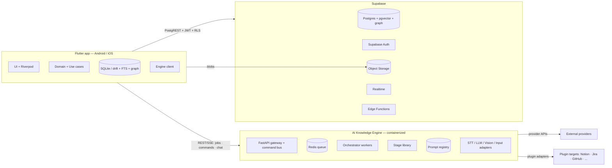
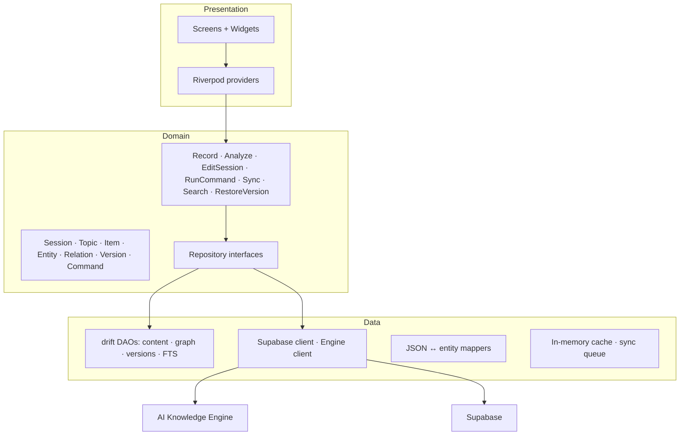
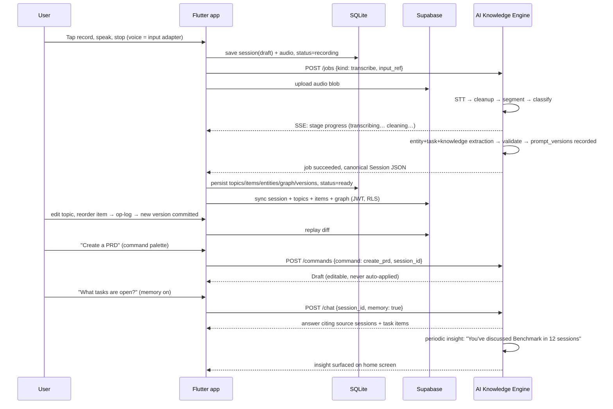

# Architecture — AI Knowledge Companion

This document is the technical design for the product specified in `spec.md`. It is a companion to (not a replacement for) the spec. Where this document conflicts with the spec, the spec wins; where the spec is silent, this document decides.

Status: **Binding technical architecture baseline.** Fully implemented across Phases 1–6 (Android Jetpack Compose client, Flutter Drift v10 client, Python FastAPI 9-stage engine, and Supabase migrations).

---

# 1. Goals and Principles

## 1.1 Framing: an AI Knowledge Engine, not a voice recorder

This product is designed as an **AI Knowledge Engine**. Voice capture is the *first supported input adapter*, not the product. The engine model is:

```text
Voice · Images · PDFs · Screenshots · Emails · Documents · Meeting recordings · Manual notes

        ▼
Universal Input Pipeline  (each input type = a replaceable adapter)

        ▼
Knowledge Engine
  (orchestrated AI stages → Sessions · Topics · Tasks · Ideas · Knowledge Graph)

        ▼
Search · Chat · Exports · Automation · Plugins
```

Everything downstream — orchestration, canonical JSON, editing, search, sync, chat, exports — is **input-agnostic**. Adding a new input type later must not require a redesign; it is a new adapter plus whatever preprocessing it needs (OCR, STT, doc parsing).

## 1.2 Principles (from spec §29, plus design commitments)

- **Offline-first.** Capture, browse, edit, and search work with no network; sync happens in the background.
- **Provider-agnostic AI.** STT/LLM providers sit behind interfaces; adding a provider is a drop-in addition, never a rewrite.
- **Structured JSON is the source of truth.** Canonical data is `Session → Topics → Items`. Markdown is only an export format, never stored truth.
- **User control.** All AI output is editable — including topics, items, the graph, and confidence overrides. AI never locks content.
- **Orchestration over monolith prompt.** The AI pipeline is a chain of single-responsibility, independently replaceable stages driven by an orchestrator.
- **Everything is versioned.** Prompts are versioned assets; session content is version history; every AI/LLM interaction is reproducible.
- **Privacy-first intelligence.** Cross-session memory and insights are opt-in and operate only on the user's own data.
- **Fast startup (<2s), clean layering.** Local-first reads; boundaries that let phases 3–6 slot in without rewrites.

---

# 2. System Context



**Topology decisions**

1. **Supabase is the cloud backend** (spec §25 lists "Supabase or Firebase"). Rationale: SQL parity with on-device SQLite, `pgvector` for semantic search, Row-Level Security, Realtime for sync/job events, self-hostable (coherent Docker story). Firebase remains an alternative behind an abstracted sync layer.
2. **The app never talks to AI providers directly.** All AI traffic goes through the **Knowledge Engine**. Keys stay server-side (or in device secure storage only for user-configured *custom providers*); local/self-hosted models (Ollama, LM Studio, local Whisper) plug into the same engine.
3. **Canonical JSON schema is a shared, versioned contract** (§5). Both Dart and the engine validate against the same JSON Schema files; a CI contract test catches drift.

---

# 3. Frontend (Flutter)

## 3.1 Stack

| Concern | Choice | Notes |
|---|---|---|
| Language / UI | Dart / Flutter | Android + iOS single codebase (spec §25) |
| State management | Riverpod | `AsyncNotifier`, families for per-entity state |
| Local DB | SQLite via **drift** | Typed queries, migrations, streams |
| Graph store | drift tables + `sqlite-vec` | Knowledge graph, semantic index (Phase 6) |
| Secure storage | `flutter_secure_storage` | Provider keys, refresh tokens |
| Audio | `record` + `just_audio` | Recording, playback, waveform, background |
| Networking | `dio` (engine) + `supabase_flutter` | |
| Navigation | go_router | Deep links to sessions, versions, graph nodes |
| JSON validation | `json_schema` | Vendored contract (§5.2) |

## 3.2 Clean architecture layers



Rules:

- Dependency rule: Presentation → Domain → Data. Domain has zero Flutter/SQL/network imports.
- Repository interfaces in Domain; implementations in Data. This is what makes cloud providers swappable and everything mockable.
- Screens consume Riverpod providers only; they never import data/ classes.

## 3.3 Directory layout

```
src/
  app/                      # entrypoint, router, theme, DI, bootstrap
  core/
    errors/                 # typed failures, user-friendly messages
    logging/
    secure_storage/
    sync/                   # sync engine, outbox, conflict resolver
    engine/                 # jobs · commands · chat clients, SSE stream
    graph/                  # local graph store, traversal
  features/
    auth/
    home/
    recording/              # input adapters surface (voice first)
    session_detail/
    transcript/
    search/
    chat/
    commands/               # AI command palette + drafts
    versions/               # version history + restore
    graph/                  # graph browser per-session + global
    export/
    settings/               # providers · memory · plugins · privacy
    organization/           # favorites · archive · trash · pin
  domain/
    entities/
    usecases/
    repositories.dart       # abstract interfaces
  data/
    local/                  # drift: tables, DAOs, migrations
    remote/                 # supabase data sources, storage
    engine/                 # REST + SSE clients
    mappers/
```

Each feature owns screens, widgets, feature-scoped providers. Global state (auth, settings, sync status) lives at `app/`/`core/` scope.

## 3.4 State model

- **Pipeline visibility is first-class.** Sessions expose a lifecycle state machine (§4.5). The UI renders `transcribing → cleaning → analyzing → validating → ready` with live progress from SSE, and a *resume/retry* affordance on failure.
- **Edits are an operation log** (`InsertItem`, `MoveTopic`, `ChangeItemType`, `AddEntity`, `LinkEntities`, …) — powering undo/redo (Phase 3), atomic sync diffs, and version commit points (§4.6).
- **Commands are drafts.** AI command results open as an editable Draft (not auto-saved content), so nothing the AI produces is ever locked.
- **Confidence renders as hints.** Low-confidence results (topics, items, entities, summaries) get subtle markers; the user can override confidence or discard the item.

---

# 4. AI Knowledge Engine (Backend)

## 4.1 Components

| Component | Role | Ownership |
|---|---|---|
| **Supabase** (managed Postgres + Auth + Storage + Realtime + Edge Functions) | Persistence, identity, files, sync events, thin glue | Managed or self-hosted (§8) |
| **AI Knowledge Engine** (Python/FastAPI) | Orchestrated AI pipeline, commands, chat, memory, insights, prompt registry | Self-owned, containerized |
| **Queue + orchestrator workers** (Redis + Python workers) | Long-running jobs decoupled from request/response | Self-owned |
| **Plugin adapters** | Outbound integrations (Notion, Jira, GitHub, …) — Phase 6 | Self-owned |
| **Edge Functions** | Webhooks, scheduled jobs (backfill, insights), notifications | Optional |

## 4.2 AI Orchestration Layer (spec §26, expanded)

The pipeline is **not** one LLM call. It is a chain of single-responsibility stages driven by an `Orchestrator`. Each stage is independently replaceable and independently versioned (see §4.3).

```text
Transcript (or any input's extracted text)

  ▼
1  Cleanup                 — fillers, punctuation, capitalization, sentence merge
  ▼
2  Topic Segmentation      — boundaries between subjects
  ▼
3  Topic Classification    — labels + descriptions per topic
  ▼
4  Entity Extraction       — people, projects, orgs, ideas, decisions → graph nodes
  ▼
5  Task Extraction         — tasks, action items, reminders → items + graph edges
  ▼
6  Knowledge Extraction    — typed items + summary + title(s) → canonical Session JSON
  ▼
7  Validation              — JSON Schema, confidence checks, graph invariants
  ▼
8  Structured JSON         — canonical Session → app → SQLite → Supabase
```

**Stage contract** (single responsibility + replaceability is the load-bearing requirement):

```python
class Stage(Protocol):
    name: str

    async def run(self, ctx: StageContext) -> StageContext: ...


class StageContext:
    input_doc: InputDoc  # transcript / extracted text / metadata
    intermediates: dict[str, Any]  # outputs of earlier stages, by stage name
    config: StageConfig  # provider, model, temperature, prompt_version
    budget: TokenBudget
```

- **Composition, not nesting.** The orchestrator holds an ordered `list[Stage]` resolved from config. Stages communicate only via `StageContext`. A stage can be removed, added, reordered, or pointed at a different provider/model/prompt version without touching the others.
- **Purity.** Every stage is a pure `(input, config) → output` function; nothing is persisted inside a stage. The orchestrator owns persistence and resumability.
- **Idempotency + resumability.** The orchestrator persists each completed stage's output to the job record. A crashed or failed job resumes from the last completed stage (this is the recovery mechanism for the lifecycle in §4.5).
- **Entity and Task extraction are dedicated stages** because their outputs feed the knowledge graph (§4.8) and cross-session intelligence (§4.9) — they are not buried in a summary prompt.

## 4.3 Prompt Registry & Versioning

Prompts are **versioned assets, not code**. Every session records exactly which prompt versions produced it, and old sessions can be re-run with newer prompts.

- **Assets:** `engine/prompts/<stage>.<version>.json`, e.g. `cleanup.9.json`, `knowledge_extraction.3.json`. Each asset is `{ system_prompt, user_prompt_template, temperature, max_tokens, json_schema_ref }`.
- **Registry:** `PromptRegistry.resolve(stage, version) -> PromptAsset`. `version=None` resolves to the current latest for that stage. Migrations/renames are recorded so history stays readable.
- **Canonical JSON records provenance:**

  ```json
  "prompt_versions": { "cleanup": 9, "segmentation": 3, "classification": 2,
                       "entity_extraction": 4, "task_extraction": 3,
                       "knowledge_extraction": 5 }
  ```

- **Re-run:** `POST /api/v1/jobs {kind: analyze, session_id, prompt_versions: {knowledge_extraction: 9}}` produces a new analysis **as a new session version** (§4.6). The old one is never destroyed.
- **UI:** session detail shows "Generated with cleanup v9 · extraction v5" and a "Re-analyze with latest prompts" action.
- **Contract tests pin behavior per prompt version** so bumping a prompt is a reviewable diff, not a silent change.

## 4.4 Provider abstraction (unchanged requirement, now reused by stages)

```python
class TranscriptionProvider(Protocol):
    async def transcribe(self, audio, *, model, language, ...) -> Transcript

class LLMProvider(Protocol):
    async def complete(self, messages, *, model, temperature, max_tokens, json_schema=None)
    async def complete_structured(self, prompt, json_schema, *, model) -> dict

REGISTRY: dict[str, type[TranscriptionProvider | LLMProvider]]
```

- Adapters map provider-native shapes → canonical types *inside the adapter*; no provider types leak into pipeline code.
- `complete_structured` uses provider-native structured output when available; otherwise prompt-constrained JSON + schema validation.
- **Custom providers** are adapters registered at runtime from user-supplied base URL/model/key — "custom API" with zero code changes.
- Stages select provider + model + prompt version per run; this is how "re-run with a different model" is an operation, not a refactor.

## 4.5 Session processing pipeline (lifecycle)

Every session is a state machine. States are explicit, user-visible, and recoverable:

```text
recording → uploading → transcribing → cleaning → analyzing → validating
        → ready → (user edits) → edited → synced
```

- Terminal: `failed`, `cancelled`. Failures are never silent — `last_error` is structured and shown with a **resume from last completed stage** action.
- Transitions are idempotent; each step writes its outcome to `session.status` + job progress. The app re-subscribes and continues after interruption.
- `edited` is not the end: edits trigger version commits (§4.6) and re-sync; `synced` reflects cloud convergence, not merely local success.

## 4.6 Version history

Every meaningful change to a session's knowledge produces a version:

```text
V1  (AI output, prompt v9)   → V2 (manual edit)  → V3 (restored from V1) → ...
```

- **Storage:** `session_versions(session_id, version_no, snapshot_json, prompt_versions, change_reason, created_at)`. Full canonical snapshot per version in SQLite; the cloud stores the same with diffs computed on demand.
- **Commit points:** initial AI output, every debounced edit batch, prompt re-runs, restores, and merges/splits. The op-log (§3.4) supplies the human-readable "what changed" per version.
- **Restore:** `POST /api/v1/sessions/{id}/versions/{v}/restore` → snapshot becomes a *new* working copy + new version. AI output is always recoverable, even after extensive manual edits.
- **UI:** a timeline picker in session detail; diff view (topics/items added, removed, moved).

## 4.7 Confidence

Confidence is collected per granularity and used for UI hints and downstream weighting, never as authoritative truth:

| Field | Where | Use |
|---|---|---|
| `summary_confidence` | session | hint + memory weighting |
| `topic.confidence` | topic | highlight uncertain topic segmentation |
| `item.confidence` | item | highlight uncertain extractions |
| `entity.confidence` | entity/relation | graph edge weighting |
| `extraction_confidence` | session | overall quality for insight/memory ranking |

Confidence is produced by stages (self-assessed against validation signals) and **user-overridable**. Low-confidence results get visual markers; users can accept, fix, or discard.

## 4.8 Knowledge graph (first-class subsystem)

Entity and task extraction feed a persistent, per-user graph of people, projects, organizations, ideas, tasks, and decisions.

- **Nodes:** `entities(id, user_id, type, name, canonical_name, aliases, metadata)`. Identity resolution merges aliases ("Benchmark", "Benchmark Platform").
- **Edges:** `relationships(id, user_id, source_id, target_id, type, weight, confidence, session_id)` — types like `participates_in`, `leads`, `discusses`, `depends_on`, `assigned_to`.
- **Derived, then user-owned.** The graph is AI-generated but fully editable — add/rename/merge nodes, create/delete/relabel edges (spec: AI never locks content). Edits become versions like session content.
- **Serving:** per-session subgraph (session detail), global browse (Phase 6), and the engine for cross-session intelligence (§4.9). Local traversal via drift; cloud traversal via Postgres recursive CTEs.

## 4.9 Cross-session intelligence & AI memory

These are separate concerns with shared machinery (graph + embeddings), both **opt-in** (spec §30; privacy-first).

- **Cross-session intelligence:** periodic/on-demand `POST /api/v1/insights` generates statements like *"You've discussed Benchmark Platform in 12 sessions"*, linked to those sessions. Grounded in graph node clustering + `pgvector`/`sqlite-vec` similarity; each insight records its sources so it is explainable.
- **AI memory:** with the user's permission, the orchestrator may attach a compact **memory context** to a new session's analysis — related sessions' titles, summaries, and open tasks, within a token budget, each tagged with source session IDs so the answer is traceable. The pipeline stays input-agnostic; memory is just an additional stage input.
- **Privacy:** memory/insight context is derived server-side from the user's own data only, never shared, revocable per-user, and skip-able per session. No cross-user data ever enters these features.

## 4.10 AI commands

Commands are **reusable actions available inside every session**, unified through a command bus instead of ad-hoc features.

```text
create_tasks · create_email · create_prd · create_roadmap · create_report
create_jira_stories · create_meeting_minutes · explain · expand · rewrite · summarize
```

- `POST /api/v1/commands {command, session_id, params}` → job → **Draft** (editable, never auto-applied). Drafts can be exported or saved into the session as content.
- Commands are **thin handlers over existing pipeline primitives** (extraction + rewrite stages) plus a prompt asset in the registry (`commands/create_prd.1.json`). Adding a command = new prompt asset + small handler; it is not a new subsystem.
- This replaces scattered feature screens (spec §23) with one uniform palette, and is the seam the plugin system (§4.11) extends later.

## 4.11 Plugin system (Phase 6)

Outbound integrations behind an adapter interface, so services plug in without hard-coding:

```python
class Plugin(Protocol):
    kind: str                       # notion | jira | github | ...
    async def push(self, draft, target, credentials) -> PushReceipt
```

- Data leaves the engine as **canonical JSON transformed per target** (structured for issue trackers, Markdown for docs). OAuth2 per plugin; credentials in server-side secret store.
- First-class in the architecture now, implemented last: the command → draft → export flow is the same seam plugins attach to.

## 4.12 Universal input pipeline

Voice is adapter #1. The engine's first stage is ingestion, and everything downstream never assumes audio:

```python
class InputSource(Protocol):
    kind: str                       # voice | image | pdf | email | ...
    async def ingest(self, blob_ref, meta) -> InputDoc   # text + normalized metadata

# kind-specific preprocessing: STT (voice), OCR (images/PDFs), parsers (email/docs)
# → one canonical InputDoc → Orchestrator (sections §4.2–4.5)
```

The mobile capture surface already routes through this: `recording/` feature = voice adapter UI. Later inputs add a picker entry point and a preprocessing step, nothing else.

## 4.13 Sync engine (frontend)

- **Write-through with outbox:** mutations write to SQLite immediately (offline-capable) and enqueue sync records.
- **Incremental pull:** `updated_at > last_sync` with tombstones for deletion.
- **Conflict resolution:** field-level, last-write-wins by default; true conflicts flagged for review. Versions and graph merges use the same resolver (a conflict is just a branch the user reconciles).
- **Diffs, not documents:** reorder/merge/split replay as diffs, never full-document replacement.

---

# 5. Database

## 5.1 Canonical JSON (the source of truth)

```json
{
  "schema_version": 1,
  "session": {
    "id": "uuid",
    "title": "EAG Benchmark Platform Planning",
    "alternative_titles": ["..."],
    "summary": "one-paragraph overview",
    "summary_confidence": 0.9,
    "extraction_confidence": 0.87,
    "language": "en",
    "status": "ready",
    "created_at": "iso8601",
    "duration_sec": 240,
    "word_count": 612,
    "prompt_versions": {
      "cleanup": 9, "segmentation": 3, "classification": 2,
      "entity_extraction": 4, "task_extraction": 3, "knowledge_extraction": 5
    },
    "topics": [
      {
        "id": "uuid",
        "position": 0,
        "title": "Benchmark Platform",
        "description": "...",
        "confidence": 0.92,
        "items": [
          {
            "id": "uuid",
            "type": "task",
            "position": 0,
            "title": "Add caching to benchmark platform",
            "description": "...",
            "priority": "high",
            "timestamp_sec": 12.5,
            "confidence": 0.95
          }
        ]
      }
    ]
  }
}
```

- Item `type` ∈ spec §10 taxonomy: `idea, task, decision, question, problem, risk, goal, event, reminder, reference, observation, opportunity, action_item`.
- `prompt_versions`, confidence fields, and `status` are provenance/quality metadata, not display content.

## 5.2 Shared JSON Schema contract

`engine/schemas/*.json` is the single source of truth for canonical shapes (session, entities, relationships, versions, commands). Flutter **vendors a generated copy** (`src/data/contract/`); both sides validate on write and read. A CI contract test regenerates and diffs the Dart copy.

## 5.3 Local schema (SQLite / drift)

```mermaid
erDiagram
    sessions ||--o{ topics : contains
    topics ||--o{ items : contains
    sessions ||--o{ session_tags : tagged
    tags ||--o{ session_tags : used_by
    sessions ||--o{ session_versions : versioned
    sessions ||--o{ jobs : processed_by
    sessions ||--o{ embeddings : embeds
    sessions ||--o{ session_entities : mentions
    entities ||--o{ session_entities : mentioned_in
    entities ||--o{ relationships : source
    entities ||--o{ relationships : target
    users ||--o{ sessions : owns
    users ||--o{ tags : owns
    users ||--o{ provider_settings : owns
    users ||--o{ entities : owns

    sessions { text id PK; text user_id; text title; text alt_titles_json; text summary; real summary_confidence; real extraction_confidence; text language; text status; real duration_sec; int word_count; text original_transcript; text cleaned_transcript; text audio_path; text audio_remote_url; text prompt_versions_json; int favorite; int archived; int deleted; text last_error_json; int created_at; int updated_at }
    topics { text id PK; text session_id FK; int position; text title; text description; real confidence }
    items { text id PK; text topic_id FK; int position; text type; text title; text description; text priority; real timestamp_sec; real confidence }
    session_versions { text id PK; text session_id FK; int version_no; text snapshot_json; text prompt_versions_json; text change_reason; int created_at }
    tags { text id PK; text user_id; text name; text color }
    session_tags { text session_id FK; text tag_id FK }
    entities { text id PK; text user_id; text type; text name; text canonical_name; text aliases_json; text metadata_json }
    session_entities { text session_id FK; text entity_id FK; real confidence }
    relationships { text id PK; text user_id; text source_id FK; text target_id FK; text type; real weight; real confidence; text session_id; int deleted }
    jobs { text id PK; text user_id; text kind; text status; text stage; text input_ref; text result_json; text error_json; int created_at; int updated_at }
    provider_settings { text id PK; text user_id; text kind; text provider; text config_json }
    embeddings { text id PK; text session_id FK; text scope; text content_ref; blob vector }
```

Notes:

- Structured tables (not blobs) so editing, ordering, merging, splitting, graph traversal, and search are expressible in SQL.
- FTS5 over `titles/summary/transcript/items/entities`; `sqlite-vec` for semantic search (Phase 6).
- Drift migrations versioned; cloud migrations via committed Supabase SQL files.

## 5.4 Cloud schema (Postgres)

Same relational shape plus:

- `users` from Supabase Auth; app tables reference `auth.users(id)`.
- **Row-Level Security** on every user table: `for all to authenticated using (user_id = auth.uid())`. `relationships`/`entities` are reachable only through owning `user_id`.
- `pgvector` + `embeddings` for Phase 6 semantic search and related-session discovery.
- Recursive CTE-friendly graph tables for global traversal (§4.8).
- FTS index on `sessions`; soft delete (`deleted_at`) everywhere to support trash + tombstones.
- `session_versions` stores full snapshots (storage is cheap relative to correctness); diffs computed on demand.

---

# 6. Authentication

| Aspect | Design |
|---|---|
| Providers | Google Sign-In (primary, spec §4); design allows Apple/Microsoft/Email/Anonymous later |
| Mechanism | Supabase Auth OAuth; Google credential → Supabase session (access + refresh JWTs) |
| Storage | Session cached in `flutter_secure_storage`; refresh token rotated |
| App↔Supabase | `supabase_flutter` sends `Authorization: Bearer <jwt>`; RLS enforces `user_id = auth.uid()` |
| App↔Engine | Engine verifies the same Supabase JWT → `user_id` for job/command ownership; service-to-service API key for Edge Functions → Engine |
| Plugin auth | OAuth2 per plugin target; credentials in server-side secret store (§4.11) |
| Anonymous mode (future) | Local-only identity, no cloud sync; out of scope for Phase 1 |
| Logout | Local DB wipe of user-scoped rows + graph + versions, secure storage cleared; cloud rows retained (re-sync on next login) |

Capture is never gated on auth: a signed-out user records locally; sync binds to identity on sign-in (spec §4 ties cloud sync to the authenticated account).

---

# 7. APIs

## 7.1 Engine (REST + SSE)

| Method | Path | Purpose |
|---|---|---|
| `POST` | `/api/v1/jobs` | Create job (`kind`, `input_ref`, `options`, optional `prompt_versions`) → `202 {job_id}` |
| `GET` | `/api/v1/jobs/{id}` | Status (stage + progress) + result |
| `POST` | `/api/v1/jobs/{id}/cancel` | Cancel queued/running job |
| `GET` | `/api/v1/jobs/{id}/stream` | SSE: stage transitions + streaming transcription |
| `POST` | `/api/v1/jobs/{id}/resume` | Resume a failed job from last completed stage |
| `POST` | `/api/v1/commands` | AI commands → Draft (§4.10) |
| `POST` | `/api/v1/chat` | Session Q&A, memory-aware when enabled (§4.9) |
| `POST` | `/api/v1/insights` | Cross-session intelligence (§4.9) |
| `POST` | `/api/v1/sessions/{id}/versions/{v}/restore` | Version restore (§4.6) |
| `POST` | `/api/v1/plugins/{kind}/push` | Push draft to plugin target (Phase 6) |
| `GET` | `/healthz`, `/readyz`, `/metrics` | Ops |

Envelope: `{ "status", "data" | "error": { code, message, details } }`. Streams via SSE (proxy-friendly), versioned under `/api/v1`.

## 7.2 Supabase / PostgREST

- **CRUD** on `sessions/topics/items/entities/relationships/session_versions/tags/provider_settings` via generated PostgREST, JWT + RLS authorized. No hand-written CRUD API.
- **Storage** presigned URLs: app PUTs audio/blobs → `sessions/{user_id}/{session_id}.m4a`; Engine GETs by service-role.
- **Realtime** broadcast on `user:{user_id}`: cross-device sync + job/command completion.
- **Edge Functions** (thin): provider webhooks, scheduled backfills/insights, notifications.

## 7.3 Versioning & backward compatibility

- Engine API is `/api/v1`; additive-only within a major version.
- Canonical JSON carries `schema_version`; readers accept `<= current` and migrate on read. Prompt versions are independent of schema versions.

---

# 8. Deployment

## 8.1 Environments

| Env | Cloud backend | Engine |
|---|---|---|
| `dev` | Local Supabase (Docker) or free tier | Local Docker Compose |
| `staging` | Managed Supabase project | Container on staging host |
| `prod` | Managed Supabase project (+ backups, monitoring) | Managed container fleet |

## 8.2 Engine

- **One Docker image, two roles:** `web` (FastAPI gateway) and `worker` (orchestrator workers); scale workers horizontally for long transcription/analysis jobs.
- **Self-hosted/local-model profile:** compose profile adds Ollama (local LLM) and/or local Whisper → fully private processing.

## 8.3 Mobile CI/CD

- Build/test: Codemagic or GitHub Actions — `flutter analyze`, `flutter test`, contract tests, golden tests.
- Distribute: Fastlane → TestFlight + Play internal (staging), promote to stores.
- Config via `--dart-define` (Supabase URL/anon key, engine base URL, feature flags). Never bake secrets.

## 8.4 Infrastructure

- Supabase managed: automatic backups, PITR, monitoring.
- Engine: structured JSON logs → stdout → aggregation; Sentry for errors; Prometheus `/metrics` for job/stage durations, queue depth, failure rates.

---

# 9. Docker

## 9.1 Images

| Image | Base | Notes |
|---|---|---|
| `engine` | `python:3.12-slim` | Multi-stage: builder (deps) → runtime. Installs FFmpeg for audio preprocessing. |

## 9.2 Compose topology (local / self-hosted)

```yaml
services:
  engine-web:     # FastAPI gateway + command bus
    image: engine
  engine-worker:  # orchestrator workers
    image: engine
    command: worker
  redis:          # queue + pub/sub
    image: redis:7-alpine
  supabase:       # optional: self-hosted cloud backend (managed in prod)
    # official supabase/docker stack
  ollama:         # optional profile: private local LLM
    image: ollama/ollama
```

- Jobs are idempotent; workers can restart safely mid-job (resume from last completed stage).
- Healthchecks wired to compose `depends_on` and orchestrator probes.
- Secrets via env/Docker secrets; no keys in images; `.dockerignore` excludes tests, caches, local schemas source.

---

# 10. Testing

## 10.1 Strategy per layer

| Layer | Test type | What it verifies |
|---|---|---|
| Domain (Dart) | Unit | Use cases, cleanup algorithm, item typing, op-log undo/redo, conflict resolution |
| Data — local (Dart) | Integration | drift migrations, DAOs, FTS, graph invariants, version commit/restore, outbox replay |
| Data — remote (Dart) | Integration (mock server) | PostgREST client, RLS-driven behavior, sync pull |
| Orchestration (Python) | Unit | Stage purity/order, resume-from-stage, malformed-LLM → retry → structured error |
| Providers (Python) | Unit + **golden fixtures** | Adapter mapping provider-native → canonical, per recorded fixture |
| Prompts (Python) | **Prompt contract tests** | Each `(stage, version)` asset: schema-conformant output on pinned fixtures; version bump = reviewable diff |
| Contract (cross-lang) | CI job | Server JSON Schema ↔ vendored Dart parity (regenerate + diff) |
| Graph (Python/Dart) | Unit | Node merge/aliasing, edge invariants, traversal results |
| Widget (Dart) | Widget | Screens + providers: lifecycle rendering, command palette, version restore, confidence hints |
| E2E (Dart) | `integration_test` | Capture → mock engine → structured session on device; offline capture + later sync; failed stage → resume |

## 10.2 Key non-obvious test targets

- **Schema validation is the backbone:** every adapter, every stage, every prompt version output must pass canonical JSON Schema. This is what keeps provider/prompt churn from silently corrupting data.
- **Cleanup preserves meaning:** golden tests pin that filler removal never drops task-relevant tokens.
- **Prompt version pins:** a prompt upgrade that breaks a pinned fixture fails CI *before* it reaches users; old versions keep passing because their assets are immutable.
- **Version restore:** restore → new version → undo/redo all preserve invariants (no orphaned topics/items).
- **Graph identity resolution:** aliasing merges correctly; relationships never dangle after node merge.
- **Memory/insight provenance:** every memory-augmented answer and every insight cites source session IDs (testable, explainable).
- **Flaky/expensive:** provider goldens are recorded, not live (no network in CI). Live smoke tests are manual/scheduled.

## 10.3 CI pipeline (every PR)

```
flutter analyze → dart unit+widget tests → python unit+golden+prompt tests
→ contract parity job → build android/ios (staging) → e2e smoke (emulator)
```

All runnable in Docker for hermetic, reproducible runs.

---

# 11. Data Flow — End to End



---

# 12. Security & Privacy

- **Keys:** Supabase anon key is public by design (RLS protects data). Provider keys live only server-side (Engine env/secret store) unless the user configures a **custom provider**, where the key is encrypted in device secure storage and used for that request only.
- **Transport:** TLS everywhere; Supabase JWT verified by the Engine; no third-party SDK calls from device.
- **At rest:** cloud tables RLS-scoped per user; optional device DB encryption via SQLCipher + biometric unlock (spec §18 Privacy) behind a setting.
- **Memory & insights are opt-in**, revocable, and computed from the user's own data only. No cross-user data ever enters the pipeline. Provenance is stored so every AI answer is traceable to sources (§4.9).
- **Audio/blobs:** private user-scoped buckets; spec §18 "delete audio after processing" is a per-user setting.
- **Logging:** never log transcripts, prompts in full, keys, or tokens; structured, minimal, PII-aware.
- **E2E encryption:** out of scope for v1 (Supabase lacks native support); flagged in §14.

---

# 13. Roadmap Mapping

| Phase (spec §28) | Lands in this architecture |
|---|---|
| 1 Foundation/MVP | Flutter shell, Supabase Auth + SQLite, drift schema v1 (incl. graph/versions tables), recording (voice adapter), sync engine, Engine skeleton, provider settings |
| 2 AI Processing | Orchestrator + stages, jobs API + lifecycle, canonical schema v1, prompt registry v1, SSE progress, confidence fields |
| 3 Interactive Editing | Op-log + undo/redo, drag/drop, merge/split, **version history + restore**, diff-based sync |
| 4 Knowledge Management | FTS5 search, tags, favorites/archive/trash, playback, transcript editing, **graph browser**, low-confidence UI |
| 5 AI Productivity | **Command bus + palette**, `/chat` (memory-aware), `/insights`, export pipeline, draft → export flow |
| 6 Intelligence | Embeddings (`sqlite-vec` + `pgvector`), related sessions, knowledge graph global view, recommendations, **plugin adapters**, universal inputs (images/PDF/docs) |

---

# 14. Open Decisions & Risks

| Item | Status | Impact |
|---|---|---|
| Supabase vs Firebase | **Supabase chosen**; sync layer abstracted for swap | Low if interfaces respected |
| Python vs Dart for Engine | **Python chosen** (AI ecosystem, workers); Dart alternative shares models | Low |
| Version storage | Full snapshots both sides; diffs computed on demand. Revisit if session size grows | Low for v1; monitor |
| E2E encryption | Deferred (spec §29 "where applicable") | Medium for privacy-sensitive users |
| Conflict resolution | v1 = field-level LWW + flagged conflicts; richer merge deferred to Phase 4 | Medium for multi-device |
| Live vs recorded provider tests | Recorded goldens in CI; live smoke manual/scheduled | Low |
| Audio size / long recordings | Chunked STT + resume-from-stage design; sized in Phase 2 | Medium |
| Prompt version churn | Prompt contract tests pin behavior; still needs review discipline in practice | Medium |
| Graph scalability | Recursive CTEs fine for single-user scale; revisit at scale | Low |
| Local Whisper on-device | Not in v1; local Whisper runs server-side in the Engine | Aligns with fast-startup NFR |

---

*Associated files: `spec.md` (requirements), `AGENTS.md` (repo guidance). This document is design intent, not a spec override.*
